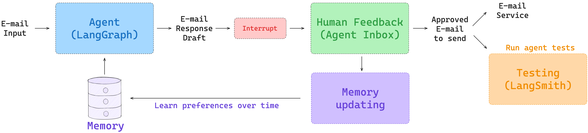
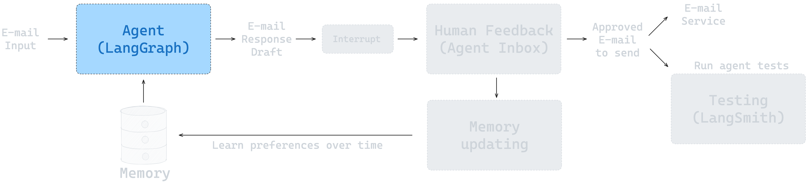
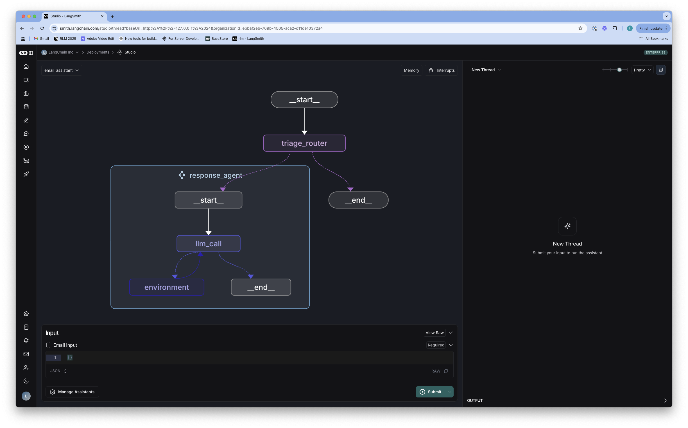
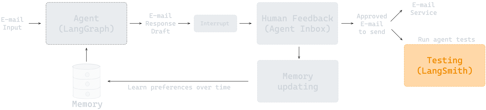
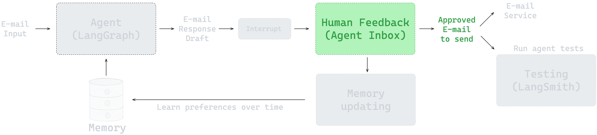
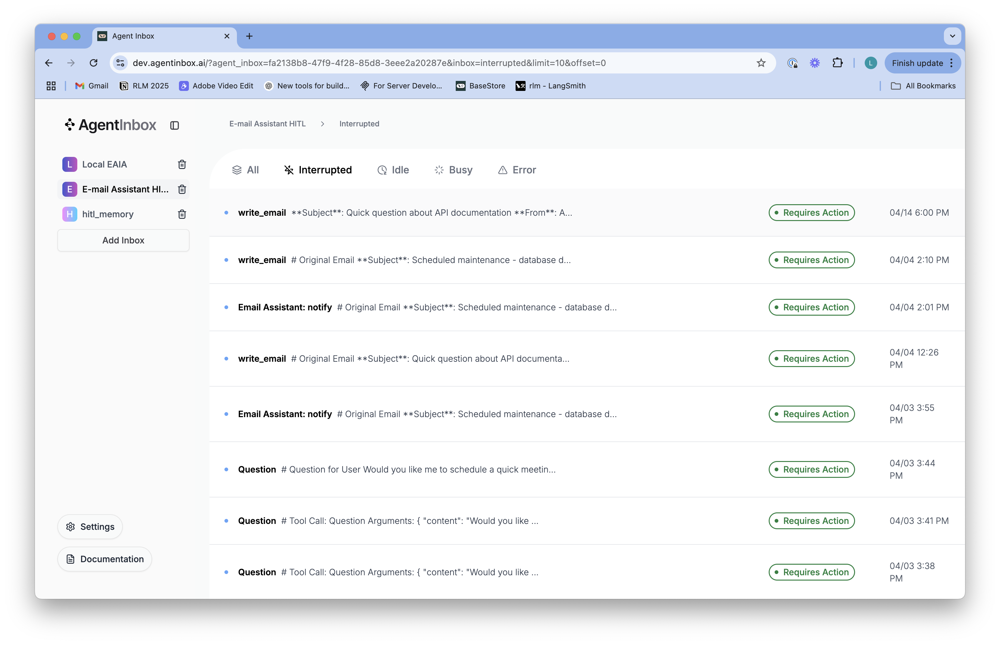

# 从零构建智能体

本仓库是一份从零构建智能体的指南，最终将实现一个可通过 Gmail API 管理邮件的[环境式（ambient）智能体](https://blog.langchain.dev/introducing-ambient-agents/)。内容分为 4 个部分，每部分都包含一个 Notebook 及 `src/email_assistant` 目录中的配套代码。这些部分依次涵盖智能体基础、智能体评估、人工介入和记忆，最终组合为一个可部署的智能体；其中的原则也可应用于大量其他智能体任务。



## 环境配置

### Python 版本

* 请确保使用 Python 3.11 或更高版本。
* 该版本可与 LangGraph 保持最佳兼容性。

```shell
python3 --version
```

### API 密钥

* 开通[阿里云百炼](https://bailian.console.aliyun.com/)并创建 API 密钥。
* 在[此处](https://smith.langchain.com/)注册 LangSmith。
* 创建 LangSmith API 密钥。

### 设置环境变量

* 在项目根目录创建 `.env` 文件：
```shell
# 将 .env.example 文件复制为 .env
cp .env.example .env
```

* 按如下内容编辑 `.env` 文件：
```shell
LANGSMITH_API_KEY=your_langsmith_api_key
LANGSMITH_TRACING=true
LANGSMITH_PROJECT="interrupt-workshop"
DASHSCOPE_API_KEY=your_dashscope_api_key
# 可选：默认使用 qwen-plus
QWEN_MODEL=qwen-plus
# 可选：北京地域的百炼 OpenAI 兼容接口为默认值
# DASHSCOPE_BASE_URL=https://dashscope.aliyuncs.com/compatible-mode/v1
```

* 也可以在终端中设置环境变量：
```shell
export LANGSMITH_API_KEY=your_langsmith_api_key
export LANGSMITH_TRACING=true
export DASHSCOPE_API_KEY=your_dashscope_api_key
```

本项目使用 `langchain-openai` 的 `ChatOpenAI` 适配器调用百炼的 OpenAI 兼容接口；它不需要 OpenAI API Key。请确保环境中已安装 `langchain-openai`。

### 安装依赖包

**推荐：使用 uv（更快且更可靠）**

```shell
# 创建虚拟环境
uv venv

# 安装项目依赖
uv pip install -r requirements.txt

# 激活虚拟环境
source .venv/bin/activate
```

**替代方案：使用 pip**

```shell
$ python3 -m venv .venv
$ source .venv/bin/activate
# 确保 pip 为较新版本
$ python3 -m pip install --upgrade pip
# 安装项目依赖
$ pip install -r requirements.txt
```

> **⚠️ 重要提示**：安装依赖后，请从项目根目录执行脚本或设置 `PYTHONPATH=src`，以便 Python 能找到 `email_assistant` 包。

## 项目内容

仓库按 4 个部分组织；每一部分都有对应的 Notebook，以及位于 `src/email_assistant` 目录中的配套代码。

### 前言：LangGraph 101

如需快速了解 LangGraph 和本仓库使用的部分概念，请参阅 [LangGraph 101 笔记本](notebooks/langgraph_101.ipynb)。该笔记本介绍聊天模型、工具调用、智能体与工作流的区别、LangGraph 的节点 / 边 / 记忆，以及 LangGraph Studio 的基础知识。

### 构建智能体
* 笔记本：[notebooks/agent.ipynb](/notebooks/agent.ipynb)
* 代码：[src/email_assistant/email_assistant.py](/src/email_assistant/email_assistant.py)



该笔记本展示如何构建邮件助手：将[邮件分诊步骤](https://langchain-ai.github.io/langgraph/tutorials/workflows/)与负责处理邮件回复的智能体结合。完整实现见 `src/email_assistant/email_assistant.py`。



### 评估
* 笔记本：[notebooks/evaluation.ipynb](/notebooks/evaluation.ipynb)



该笔记本使用 [eval/email_dataset.py](/eval/email_dataset.py) 中的邮件数据集介绍评估方法，演示如何使用 Pytest 和 LangSmith 的 `evaluate` API 运行评估。它使用 LLM-as-a-judge 评估邮件回复，也评估工具调用和分诊决策。


### 人工介入
* 笔记本：[notebooks/hitl.ipynb](/notebooks/hitl.ipynb)
* 代码：[src/email_assistant/email_assistant_hitl.py](/src/email_assistant/email_assistant_hitl.py)



该笔记本展示如何加入人工介入（HITL），使用户能够审查特定工具调用（如发送邮件、安排会议）。为此，项目使用 [Agent Inbox](https://github.com/langchain-ai/agent-inbox) 作为人工介入界面。完整实现见 [src/email_assistant/email_assistant_hitl.py](/src/email_assistant/email_assistant_hitl.py)。



### 记忆
* 笔记本：[notebooks/memory.ipynb](/notebooks/memory.ipynb)
* 代码：[src/email_assistant/email_assistant_hitl_memory.py](/src/email_assistant/email_assistant_hitl_memory.py)


该笔记本展示如何为邮件助手添加记忆，使其能从用户反馈中学习，并随时间适应用户偏好。启用记忆的助手（[email_assistant_hitl_memory.py](/src/email_assistant/email_assistant_hitl_memory.py)）使用 [LangGraph Store](https://langchain-ai.github.io/langgraph/concepts/memory/#long-term-memory) 持久化保存记忆。完整实现见 [src/email_assistant/email_assistant_hitl_memory.py](/src/email_assistant/email_assistant_hitl_memory.py)。

## 连接 API

上述笔记本使用模拟的邮件和日历工具。

### Gmail 集成与部署

请按照 [Gmail 工具 README](src/email_assistant/tools/gmail/README.md) 中的说明配置 Google API 凭据。

该 README 还说明了如何将图部署至 LangGraph Platform。

Gmail 集成的完整实现位于 [src/email_assistant/email_assistant_hitl_memory_gmail.py](/src/email_assistant/email_assistant_hitl_memory_gmail.py)。

## 运行测试

仓库包含用于评估邮件助手的自动化测试套件。

测试会验证工具使用是否正确及回复质量，并使用 LangSmith 跟踪结果。

### 使用 [run_all_tests.py](/tests/run_all_tests.py) 运行测试

```shell
python tests/run_all_tests.py
```

### 测试结果

测试结果会记录在 LangSmith 中，项目名称由 `.env` 文件中的 `LANGSMITH_PROJECT` 指定。你可以：
- 可视化检查智能体轨迹
- 查看详细评估指标
- 比较不同智能体实现

### 可测试的实现

可用于测试的实现包括：
- `email_assistant` - 基础邮件助手

### 测试笔记本

你也可以运行测试，以确认所有笔记本均能无错误执行：

```shell
# 运行全部笔记本测试
python tests/test_notebooks.py

# 或通过 pytest 运行
pytest tests/test_notebooks.py -v
```

## 后续扩展

引入 [LangMem](https://langchain-ai.github.io/langmem/) 管理记忆：
* 管理一组后台记忆。
* 添加可在后台记忆中检索事实的记忆工具。

## 项目结构

```text
.
├── AGENTS.md                         # 面向编码智能体的仓库协作说明
├── CLAUDE.md                         # 补充的仓库开发指引
├── README.md                         # 项目概览、环境配置与使用说明
├── langgraph.json                    # LangGraph 图定义与部署配置
├── notebooks/                        # 分阶段讲解的教程 Notebook
│   ├── langgraph_101.ipynb           # LangGraph 基础知识
│   ├── agent.ipynb                   # 基础邮件助手
│   ├── evaluation.ipynb              # 评估流程
│   ├── hitl.ipynb                    # 人工参与（HITL）流程
│   ├── memory.ipynb                  # 持久化记忆流程
│   ├── test_tools.py                 # Notebook 工具辅助检查
│   └── img/                          # Notebook 和 README 使用的图片资源
├── src/
│   └── email_assistant/              # 邮件助手 Python 包
│       ├── langgraph_101.py          # LangGraph 入门示例
│       ├── email_assistant.py        # 基础邮件分类与回复智能体
│       ├── email_assistant_hitl.py   # 支持人工审核操作的智能体
│       ├── email_assistant_hitl_memory.py
│       │                             # 带持久化记忆的 HITL 智能体
│       ├── email_assistant_hitl_memory_gmail.py
│       │                             # 集成 Gmail 的记忆型智能体
│       ├── configuration.py          # 运行时配置模型
│       ├── schemas.py                # 通用数据结构定义
│       ├── prompts.py                # 邮件分类和回复生成提示词
│       ├── utils.py                  # 工作流与消息处理工具函数
│       ├── cron.py                   # 定时拉取 Gmail 邮件的图
│       ├── eval/                     # 邮件数据集和评估工具
│       │   ├── email_dataset.py
│       │   ├── evaluate_triage.py
│       │   └── prompts.py
│       └── tools/                    # 智能体可调用的工具实现
│           ├── base.py               # 通用工具抽象
│           ├── default/              # 用于本地演示的模拟邮件和日历工具
│           └── gmail/                # Gmail API 工具及初始化脚本
└── tests/                            # 自动化测试
    ├── conftest.py                   # Pytest 配置和自定义参数
    ├── run_all_tests.py              # 智能体评估测试套件入口
    ├── test_response.py              # 工具调用和回复质量测试
    └── test_notebooks.py             # Notebook 执行测试
```
##  LangSmith Studio 运行命令
 .venv/bin/langgraph dev --no-browser --host 127.0.0.1 --port 8123


本项目围绕“逐步增强的邮件助手”组织：`notebooks` 用于分阶段讲解实现思路，`src/email_assistant` 提供可运行的 LangGraph 实现、提示词、工具和评估组件，`tests` 负责验证基础邮件助手与 Notebook。Gmail 的配置和集成代码位于 `src/email_assistant/tools/gmail`。
