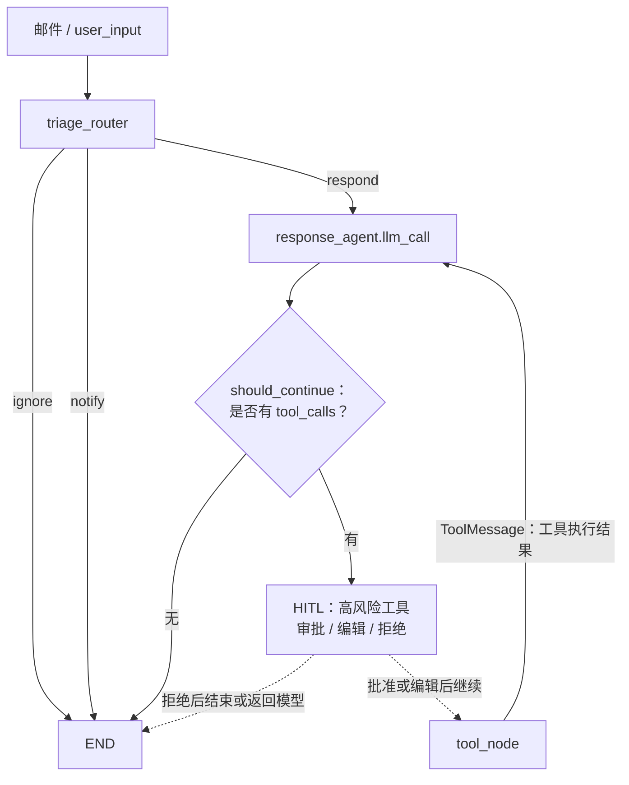

# 工具边界与完整请求链路

## 修正后的可编辑流程图

说明：基础版 `email_assistant_002.py` 中尚未接入 HITL；这里用虚线把它标为后续应插入的控制点。关键循环是
`llm_call → should_continue → tool_node → llm_call`，而不是 `tool_node → END`。

## 下一步：状态追踪（由你填写）

请只阅读 `email_assistant_002.py` 的 `triage_router`、`llm_call`、`should_continue`、`tool_node`，然后填写下表。重点不是复述代码，而是说明每个节点
**读取什么、写入什么、为什么这样流转**。

| 节点 | 决策 / 职责 | 读取的状态 | 写入或追加的状态 | 本场景的下一跳 |
| --- | --- | --- | --- | --- |
| `triage_router` | 对邮件进行 `ignore` / `notify` / `respond` 分类并路由。 | 先读取 `email_input`；仅当其缺失时，读取最后一条 `messages` 并标准化为 `email_input`。 | 写入 `email_input`、`classification_decision`；仅 `respond` 时追加一条用户 `messages`。 | `respond` → `response_agent`；其余 → `END`。 |
| `response_agent.llm_call`（第一次） | 根据邮件上下文和历史消息，生成回复或请求工具调用。 | 同时读取 `email_input` 和 `messages`。 | 追加一条 AI 消息；该消息可能带有 `tool_calls`。 | `should_continue` |
| `response_agent.should_continue` | 检查最后一条 AI 消息是否包含工具调用。 | 最后一条 AI 消息的 `tool_calls`。 | 不写入状态。 | 有调用 → `tool_node`；无调用 → `END`。 |
| `response_agent.tool_node` | 执行模型请求的一个或多个工具调用。 | 最后一条 AI 消息中的每个 `tool_call`。 | 追加一个或多个携带原始 `tool_call_id` 的 `ToolMessage`。 | `llm_call` |
| `response_agent.llm_call`（工具结果后） | 根据 `ToolMessage` 理解执行结果，生成最终回复或决定是否继续请求工具。 | 同时读取 `email_input` 和 `messages`，此时 `messages` 中包含工具结果。 | 追加新的 AI 消息；再由 `should_continue` 判断结束或进入下一轮工具调用。 | `should_continue` |

完成后，在下面用不超过三句话回答：

> 为什么 `tool_node` 的结果不能直接结束，而必须回到 `llm_call`？

你的回答：

`tool_node` 只负责执行工具并返回 `ToolMessage`，不负责解释结果或生成最终回复；回到 `llm_call` 后，模型才能据此回复用户、继续调用工具或结束。
