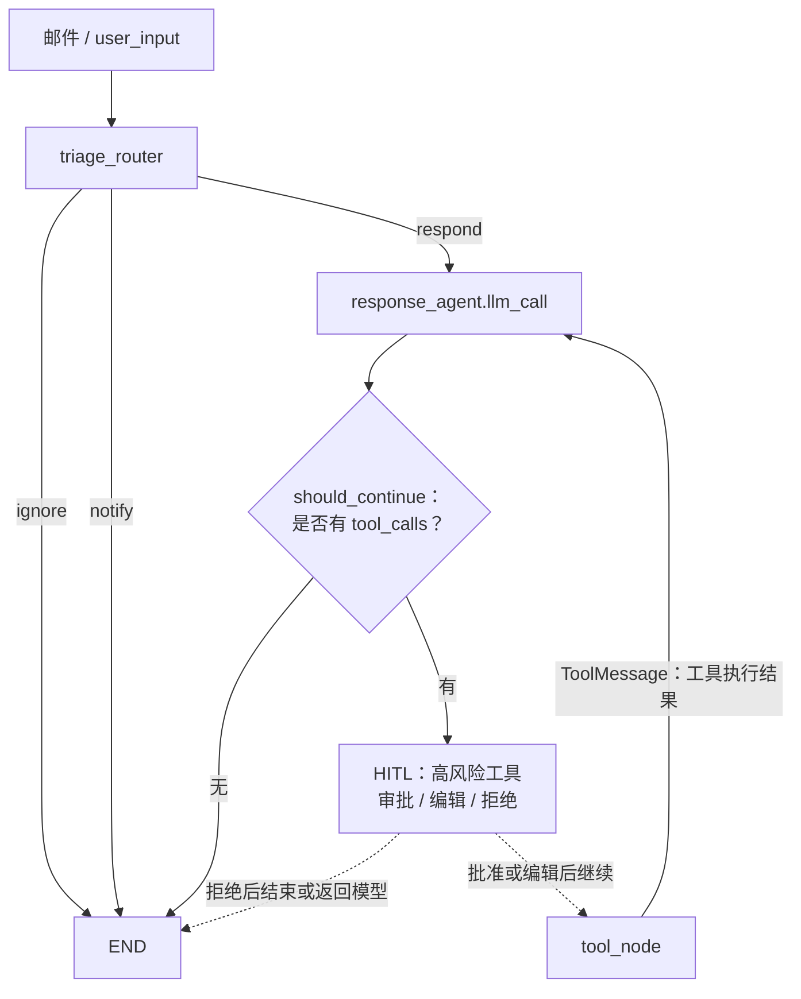

# 工具边界与完整请求链路

## 修正后的可编辑流程图

说明：基础版 `email_assistant_002.py` 中尚未接入 HITL；这里用虚线把它标为后续应插入的控制点。关键循环是
`llm_call → should_continue → tool_node → llm_call`，而不是 `tool_node → END`。

## 下一步：状态追踪（由你填写）

请只阅读 `email_assistant_002.py` 的 `triage_router`、`llm_call`、`should_continue`、`tool_node`，然后填写下表。重点不是复述代码，而是说明每个节点
**读取什么、写入什么、为什么这样流转**。

| 节点                               | 决策 / 职责                       | 读取的状态                | 写入或追加的状态                             | 本场景的下一跳            |
|----------------------------------|-------------------------------|----------------------|--------------------------------------|--------------------|
| `triage_router`                  | 邮件的分类路由处理                     | 读取user_input然后分类处理   | respond则 额外messagesg更新 其他 goto END状态等 | response_agent内层的  |
| `response_agent.llm_call`（第一次）   | 判断是否调用 tools工具                | 读取 State里面的 messages | 同时 messages 里面会追加之前的 messages        | should_continue 节点 |                   |
| `response_agent.should_continue` | 判断是否有工具执行，有则执行 tool_node,无则结束 | 获取 state里面的 messages |                                      | tool_node 节点       |
| `response_agent.tool_node`       |                               |                      |                                      |                    |
| `response_agent.llm_call`（工具结果后） | 根据tool工具进行调用,调用结果填写到state里面             | 读取state里面的 messages | 追加tool_node的返回结果                   | should_continue 节点 |                   |                                      |                    |

完成后，在下面用不超过三句话回答：

> 为什么 `tool_node` 的结果不能直接结束，而必须回到 `llm_call`？

你的回答：
tool_node 的结果不能直接结束，而是返回给 llm_call，因为 tool_node 的结果可能包含多个步骤，需要根据步骤结果进行判断，是否继续执行下一个步骤。