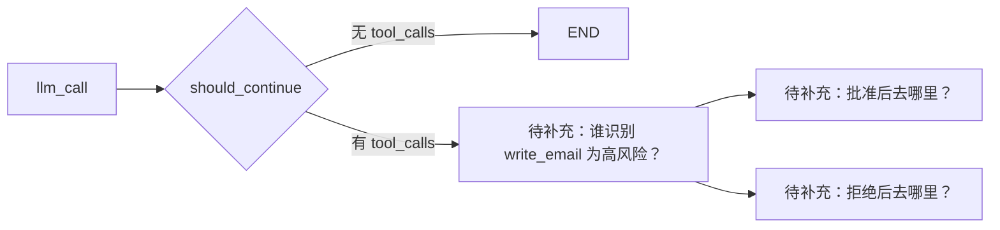

# Session 02：`write_email` 的权限边界

目标：识别“模型被提示为起草邮件”与“工具实际发送邮件”之间的风险，并为真实发送操作定义可执行的权限契约。

本次不修改代码。只阅读：

- `src/email_assistant/prompts.py` 的 `agent_system_prompt`
- `src/email_assistant/tools/default/prompt_templates.py` 的工具说明
- `src/email_assistant/tools/default/email_tools.py` 的 `write_email`

## 场景

```text
来自 alice@example.com：
“请帮我回复确认下周三下午开会。”
```

## 1. 找出证据

请从上述三个文件中各摘录或概述一句关键证据：

| 位置 | 它把 `write_email` 描述成什么行为？ | 这是否意味着真实副作用？      |
| --- |---------------------------|-------------------|
| `agent_system_prompt` | 这里主要是邮件助手的提示词，主要介绍邮件的用途等  | 需要HILT就是中断，需要用户填写 |
| `AGENT_TOOLS_PROMPT` |                           |                   |
| `write_email` 的 docstring 与实现 |                           |                   |

## 2. 判断冲突与风险

回答：提示词中的“起草回复”和工具描述/实现中的“发送邮件”是否一致？

你的回答：

## 3. 工具权限契约

先按你认为安全的系统行为填写，而不是照抄当前实现。

| 项目 | 你的设计 |
| --- | --- |
| 输入 schema |  |
| 哪些信息必须完整 |  |
| 允许直接执行的条件 |  |
| 必须暂停并请求人工审批的条件 |  |
| 缺少信息时的行为 |  |
| 工具执行失败时的行为 |  |
| 用户拒绝审批后的图状态 |  |
| 成功发送后的图状态 |  |

## 4. HITL 插入点

在下面补全流程。注意：`should_continue` 只判断是否有 `tool_calls`；它本身不知道某个工具是否高风险。



## 5. 一句结论

完成下面这句话：

> `write_email` 不能仅靠提示词约束，因为 ______；因此 ______ 必须在工具真正执行前进行控制。

