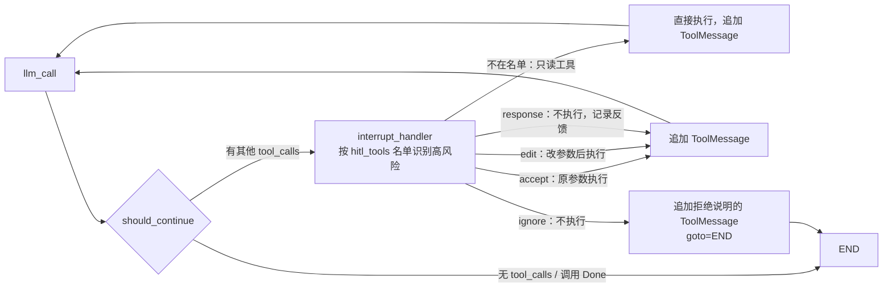

# Session 02：`write_email` 的权限边界

目标：识别“模型被提示为起草邮件”与“工具实际发送邮件”之间的风险，并为真实发送操作定义可执行的权限契约。

本次不修改代码。只阅读：

- `src/email_assistant/prompts.py` 的 `agent_system_prompt`
- `src/email_assistant/tools/default/prompt_templates.py` 的工具说明
- `src/email_assistant/tools/default/email_tools.py` 的 `write_email`

## 场景

```text
来自 alice@example.com：
“请帮我回复确认下周三下午开会。”
```

## 1. 找出证据

请从上述三个文件中各摘录或概述一句关键证据：

| 位置 | 它把 `write_email` 描述成什么行为？ | 这是否意味着真实副作用？ |
| --- | --- | --- |
| `agent_system_prompt`（`prompts.py:51`、`prompts.py:56-57`） | “回复邮件时，使用 write_email 工具**起草**回复邮件”；“使用 write_email 工具后，任务即完成”；“如果**已发送邮件**，请使用 Done 工具”。 | 文案主体称“起草”，本身不保证真实发送；但第 8 条又用“已发送邮件”指代同一次调用，提示词内部已自相矛盾。 |
| `AGENT_TOOLS_PROMPT`（`prompt_templates.py:33`） | `write_email(to, subject, content) - 向指定收件人发送邮件`。 | 是，明确表示向指定收件人发送邮件。 |
| `write_email` 的 docstring 与实现（`email_tools.py:5-9`） | docstring 为 `"""Write and send an email."""`；返回 `Email sent to {to} with subject ...`。 | 是。当前是占位实现（不产生真实副作用），但 docstring、返回文案与工具说明共同承诺了“已发送”，真实接入时会直接产生发送副作用。 |

补充证据：模型看到的**只有** docstring 和 `{tools_prompt}`，看不到 `email_tools.py` 里“占位响应：真实应用中会发送邮件”这条注释。也就是说，“它其实没发出去”这个事实对模型不可见——模型必须按“已发送”来理解自己的这次调用。

## 2. 判断冲突与风险

回答：提示词中的“起草回复”和工具描述/实现中的“发送邮件”是否一致？

你的回答：并不一致。`agent_system_prompt` 把 `write_email` 说成“起草回复”，而工具说明和实现将其定义为“发送邮件”。若模型因“起草”而调用该工具，系统却直接发送，就会在未经用户确认的情况下产生外部副作用。

进一步的风险分解：

1. **语义冲突**：同一个工具在提示词层是“草稿”，在契约层是“发送”。两层对同一次调用的后果理解不同，谁也没有权威。
2. **不可撤销**：发送是单向副作用。分诊分错、收件人取错、正文含错误承诺，都无法靠后续轮次修复——模型能重试调用，但收不回已发出的邮件。
3. **无输入校验**：`write_email(to, subject, content)` 三个参数全部是自由文本 `str`，没有收件人格式校验、没有白名单、没有空值检查。模型幻觉出的地址会被原样当作真实收件人。
4. **无失败路径**：占位实现永远返回成功字符串，从不抛异常。因此模型永远观察不到“发送失败”，也就永远不会重试或上报——一旦换成真实 SMTP，失败会以未建模的异常形式冲出工具边界。
5. **无幂等性**：没有任何 ID 或去重键。同一封邮件被调用两次就会发两次。
6. **终止条件依赖模型自觉**：提示词第 7 条说“使用 write_email 后任务即完成”，但这只是建议。真正的终止由模型是否调用 `Done` 决定（`email_assistant_hitl.py:377-378`），模型完全可以连续调用多次 `write_email`。

结论：这些风险没有一条能靠改提示词消除，因为它们都位于**工具执行的那一刻**，而提示词只能影响“模型是否想调用”。

## 3. 工具权限契约

先按你认为安全的系统行为填写，而不是照抄当前实现。

| 项目 | 你的设计 |
| --- | --- |
| 输入 schema | `to`、`from`、`subject`、`content`（现实现只有 `to, subject, content`，缺 `from`；见下方说明） |
| 哪些信息必须完整 | 邮件的接收者、邮件的发送者、邮件的标题、邮件的正文。四项缺一不可；`to` 还须通过邮箱格式校验，`content` 不得为空白串 |
| 允许直接执行的条件 | 无。`write_email` 不存在“允许直接执行”的情况——它是不可撤销的外部副作用，任何一次调用都必须先经人工审批。（可直接执行的是只读工具，如 `check_calendar_availability`） |
| 必须暂停并请求人工审批的条件 | 每一次 `write_email` 调用，无条件暂停。审批界面必须同时展示**原始来信**与**待发送的完整参数**，让人判断的是内容本身而不只是“要不要发” |
| 缺少信息时的行为 | 不发送、不猜测、不用占位值填充。工具层直接拒绝并返回结构化错误（缺哪个字段、为什么不合法），由模型据此补齐后重新提交审批；若信息只有用户才知道（如对方邮箱），改用 `Question` 工具向用户提问 |
| 工具执行失败时的行为 | 捕获异常，返回可被模型读懂的失败 `ToolMessage`（区分**可重试**如超时/限流，与**不可重试**如地址无效/无权限）。绝不把异常伪装成成功。失败后回到 `llm_call` 由模型决策；不可重试的失败应终止而非反复尝试 |
| 用户拒绝审批后的图状态 | 不执行工具，但仍必须写入一条携带原 `tool_call_id` 的 `ToolMessage`（否则消息历史里出现悬空的 `tool_call`，下一轮模型调用会报错），内容说明用户已拒绝；随后 `goto=END` 直接终止，不再交回 `llm_call`——否则模型会换个措辞重试同一个动作 |
| 成功发送后的图状态 | 写入含发送结果的 `ToolMessage`，回到 `llm_call`；模型确认无后续动作后调用 `Done`，由 `should_continue` 路由至 `END`。终止权在图，不在提示词 |

关于 `from`：现实现的 schema 里没有 `from`，发件人身份隐含在“助理代高管发信”的运行环境中。在你的设计里显式加入 `from` 是更安全的选择——它把“以谁的身份发信”变成可校验、可审批、可审计的字段，而不是一个隐含假设。代价是模型多一个可填错的参数，因此 `from` 应由系统注入或从白名单中取值，而不是让模型自由生成。

对照当前实现：上表**没有一项**在 `email_tools.py` 中实现。当前 `write_email` 无校验、无失败路径、无审批、无幂等，只有一个恒定返回成功的占位函数。这正是本次审计的结论——安全性完全依赖它之外的那一层。

## 4. HITL 插入点

在下面补全流程。注意：`should_continue` 只判断是否有 `tool_calls`；它本身不知道某个工具是否高风险。


```mermaid
flowchart LR
    A[llm_call] --> B{should_continue}
    B -->|无 tool_calls / 调用 Done| Z[END]
    B -->|有其他 tool_calls| C[interrupt_handler<br/>按 hitl_tools 名单识别高风险]
    C -->|不在名单：只读工具| F[直接执行，追加 ToolMessage]
    C -->|accept：原参数执行| G[追加 ToolMessage]
    C -->|edit：改参数后执行| G
    C -->|response：不执行，记录反馈| G
    C -->|ignore：不执行| E[追加拒绝说明的 ToolMessage<br/>goto=END]
    F --> A
    G --> A
    E --> Z
```

**谁识别 `write_email` 为高风险？** 不是 `should_continue`，而是 `interrupt_handler` 内部的白名单 `hitl_tools = ["write_email", "schedule_meeting", "Question"]`（`email_assistant_hitl.py:211`）。`should_continue` 只做“有没有 tool_calls / 是不是 Done”这一层粗路由（`:371-380`），风险判定被下沉到了执行前的最后一刻。

**为什么必须放在这一刻？** 因为这是消息历史里“工具调用已生成、但尚未 `tool.invoke()`”的唯一窗口。放在更早（提示词、路由）都只是概率性劝阻；放在更晚（工具内部）时副作用已经发生。

**四种响应的状态语义**（`email_assistant_hitl.py:273-361`）：

| 响应 | 是否执行工具 | 消息状态 | 下一跳 |
| --- | --- | --- | --- |
| `accept` | 是，用原参数 | 追加执行结果 `ToolMessage` | `llm_call` |
| `edit` | 是，用编辑后参数 | 先用 `model_copy` 复制并替换 AI 消息中该 `tool_call` 的 args（不可变更新），再追加结果 `ToolMessage` | `llm_call` |
| `response` | **否** | 追加含用户反馈的 `ToolMessage`，让模型据此重新起草 | `llm_call` |
| `ignore` | **否** | 追加“用户已忽略，结束流程”的 `ToolMessage` | `END` |

三者共性：**无论是否执行工具，都必须写回一条带原 `tool_call_id` 的 `ToolMessage`。** 这是 HITL 恢复路径的硬约束——中断打断的是执行，不是消息协议的完整性。

`edit` 分支值得单独注意：它不只是换参数执行，还要同步改写**历史里那条 AI 消息**。否则消息记录会显示“模型请求发 A”而工具结果是“已发 B”，后续轮次的模型将基于错误的自我认知继续推理。

**一处待验证的观察**：`should_continue`（`:371-380`）的 `for` 循环在第一个 `tool_call` 上就 `return`，且当 `tool_calls` 为空时没有显式返回值（隐式 `None`）。这意味着——(a) 一条消息里若混有 `Done` 和 `write_email`，结果取决于顺序；(b) 无 `tool_calls` 时返回 `None`，会落在条件边映射之外。留作下一个 session 的验证点。

## 5. 一句结论

完成下面这句话：

> `write_email` 不能仅靠提示词约束，因为**提示词只能影响模型“是否想调用”，无法约束工具“被调用时做了什么”——而发送是不可撤销的外部副作用，一次误判就无法回滚**；因此**图层面的强制中断（`interrupt_handler` 在 `tool.invoke()` 之前拦截并等待人工 accept / edit / response / ignore）**必须在工具真正执行前进行控制。

推论：判断一个动作要不要 HITL，标准不是“模型可能出错吗”（模型总会出错），而是“**出错后能不能靠下一轮修复**”。能修复的（查日历、搜记忆）直接执行；不能修复的（发信、建会、付款）必须先停下来。
